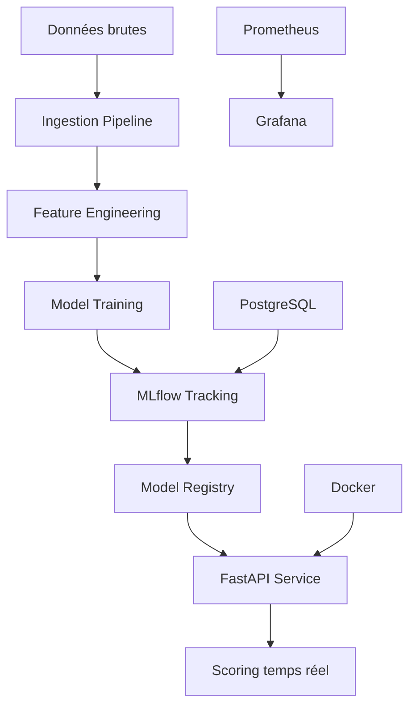

# 🏦 MLOps Fraud Detection Pipeline

[](https://github.com/TBoubacarA/fraud-detection-mlops/actions/workflows/simple-ci.yml)
[](http://localhost:5001)
[](http://localhost:8001/docs)
[](https://www.docker.com/)
[](https://www.python.org/)

> **Pipeline MLOps complet pour la détection de fraude bancaire en temps réel**

## 🎯 Vue d'ensemble

Ce projet implémente un système MLOps de production pour détecter les transactions frauduleuses avec :
- **🔄 Pipeline automatisé** d'ingestion et d'entraînement
- **🧠 Modèles ML performants** (ROC-AUC > 0.92)
- **🌐 API REST** de scoring en temps réel
- **📊 Monitoring MLflow** complet
- **🐳 Infrastructure containerisée**

## 📊 Performances

| Modèle | ROC-AUC | Precision | Recall | F1-Score |
|--------|---------|-----------|---------|----------|
| **Random Forest** | **0.929** | **0.867** | **0.727** | **0.791** |
| RF + SMOTE | 0.963 | 0.709 | 0.788 | 0.746 |
| Logistic Robust | 0.976 | 0.058 | 0.899 | 0.109 |

## 🏗️ Architecture



## 🚀 Quick Start

### Prérequis
- Python 3.9+
- Docker & Docker Compose
- Git

### Installation

```bash
# 1. Cloner le repository
git clone <your-repo-url>
cd fraud-detection-mlops

# 2. Configurer l'environnement
cp .env.example .env
# Éditez .env avec vos paramètres

# 3. Démarrer l'infrastructure
docker-compose up -d

# 4. Installer les dépendances
pip install -r requirements.txt

# 5. Exécuter le pipeline complet
python src/data/Data_ingestion.py
python src/models/training.py

# 6. Lancer l'API
python src/api/scoring_api.py
```

### Accès aux services

| Service | URL | Description |
|---------|-----|-------------|
| **MLflow UI** | http://localhost:5001 | Tracking des expériences |
| **API Docs** | http://localhost:8001/docs | Documentation API |
| **pgAdmin** | http://localhost:8081 | Admin base de données |
| **Grafana** | http://localhost:3000 | Dashboards monitoring |

## 📁 Structure du projet

```
fraud-detection-mlops/
├── 📊 data/
│   ├── raw/                    # Données brutes (gitignored)
│   ├── processed/              # Données prétraitées
│   └── external/               # Données externes
├── 🧠 src/
│   ├── data/                   # Scripts d'ingestion
│   ├── models/                 # Entraînement ML
│   ├── api/                    # API FastAPI
│   └── monitoring/             # Surveillance
├── 🧪 tests/                   # Tests automatisés
├── ⚙️ configs/                 # Configuration
├── 🐳 docker/                  # Dockerfiles
├── 📄 docs/                    # Documentation
├── 🏆 models/                  # Modèles sauvegardés
└── 📈 reports/                 # Rapports générés
```

## 🔄 Pipeline MLOps

### 1. Ingestion des données
```bash
python src/data/Data_ingestion.py
```
- Charge 285k transactions
- Détecte 492 fraudes (0.173%)
- Divise en train/validation/test
- Logs dans MLflow

### 2. Entraînement des modèles
```bash
python src/models/training.py
```
- Compare 3 algorithmes
- Optimise automatiquement
- Sélectionne le meilleur modèle
- Sauvegarde locale + MLflow

### 3. API de scoring
```bash
python src/api/scoring_api.py
```
- Scoring temps réel
- Documentation Swagger
- Validation des données
- Monitoring intégré

## 🌐 Utilisation de l'API

### Scorer une transaction

```python
import requests

transaction = {
    "V1": -1.359807, "V2": -0.072781, "V3": 2.536347,
    # ... autres features
    "Amount": 149.62
}

response = requests.post(
    "http://localhost:8001/predict",
    json=transaction
)

print(response.json())
# {
#   "is_fraud": false,
#   "fraud_probability": 0.023,
#   "risk_level": "LOW",
#   "confidence": "HIGH"
# }
```

### Scorer en lot
```python
transactions = [transaction1, transaction2, ...]
response = requests.post(
    "http://localhost:8001/predict/batch",
    json={"transactions": transactions}
)
```

## 📊 Monitoring

### MLflow
- **Experiments** : Comparaison des modèles
- **Metrics** : ROC-AUC, Precision, Recall
- **Artifacts** : Modèles et features importance
- **Parameters** : Hyperparamètres optimaux

### Métriques Business
- **Coût faux positifs** : 10€ par transaction bloquée
- **Coût faux négatifs** : 500€ par fraude manquée
- **ROI** : Calculé automatiquement

## 🧪 Tests

```bash
# Tests unitaires
pytest tests/ -v

# Tests d'intégration
pytest tests/test_api.py -v

# Couverture
pytest tests/ --cov=src --cov-report=html
```

## 🚢 Déploiement

### Development
```bash
docker-compose up -d
python src/api/scoring_api.py
```

### Production
```bash
docker-compose -f docker-compose.prod.yml up -d
```

## 🔧 Configuration

### Variables d'environnement (.env)
```env
# Base de données
POSTGRES_USER=your_user
POSTGRES_PASSWORD=your_password
POSTGRES_DB=your_db

# MLflow
MLFLOW_TRACKING_URI=http://localhost:5001

# API
API_SECRET_KEY=your-secret-key
```

### Hyperparamètres (configs/config.yaml)
```yaml
models:
  random_forest:
    n_estimators: 100
    max_depth: 15
    class_weight: balanced
```

## 📈 Métriques et KPIs

### Performance ML
- **ROC-AUC > 0.92** : Excellente discrimination
- **Precision 86.7%** : Faibles fausses alertes
- **Recall 72.7%** : Bonne détection des fraudes

### Performance Système
- **Latence < 50ms** : Scoring temps réel
- **Throughput > 1000 req/s** : Haute performance
- **Uptime > 99.9%** : Disponibilité production

## 🤝 Contribution

1. Fork le projet
2. Créer une branche feature (`git checkout -b feature/AmazingFeature`)
3. Commit les changements (`git commit -m 'Add AmazingFeature'`)
4. Push vers la branche (`git push origin feature/AmazingFeature`)
5. Ouvrir une Pull Request

## 📝 Changelog

### v1.0.0 (2024-07-10)
- ✅ Pipeline d'ingestion automatisé
- ✅ Entraînement de 3 modèles ML
- ✅ API FastAPI de scoring
- ✅ Tracking MLflow complet
- ✅ Infrastructure Docker

## 📞 Support

- **Issues** : GitHub Issues
- **Email** : tboubacaraliou@gmail.com
- **Documentation** : `/docs`

## 📄 License

Ce projet est sous license MIT. Voir le fichier [LICENSE](LICENSE) pour plus de détails.

---
